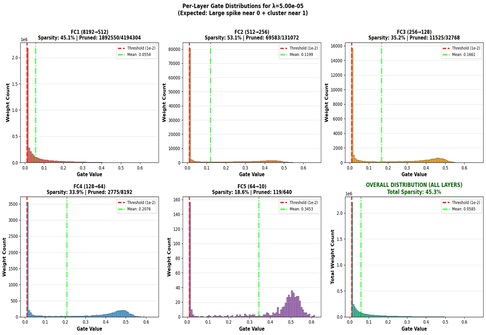

**Why Sigmoid + L1 Regularization creates Sparsity**

In this implementation, we apply an **L1 penalty** (sum of absolute values) to the output of a **Sigmoid function**. This creates a specific dynamic for the learnable “gate\_scores”:

*   **The Gradient Pressure**: The L1 loss is minimized when the gate value is exactly 0. Since sigmoid(x) only reaches 0 as x ->-infinity, the optimizer aggressively pushes the \`gate\_scores\` of unimportant weights toward very large negative values.
*   **Effective Pruning**: As the gate output approaches zero, it effectively 'multiplies away' the corresponding weight, meaning that weight no longer contributes to the forward pass or receives meaningful gradients for its value.
*   **Selection**: Only weights that contribute enough to reducing the classification loss to overcome the lambda penalty will have their gates remain 'open' (closer to 1).

**Results for different λ values:**

| Lambda | Test Accuracy (%) | Sparsity Level (%) |
| --- | --- | --- |
| 5.00e-05 | 82.94 | 45.26 |
| 1.00e-04 | 82.39 | 49.57 |
| 5.00e-04 | 80.88 | 55.58 |

The table presents the results obtained for different values of λ, showing how test accuracy and sparsity level vary as the sparsity regularization strength changes. From these results, I observe a clear trade-off between model accuracy and sparsity.

For λ = 5.00e-05, I obtained a test accuracy of 82.94% with a sparsity level of 45.26%. Since λ is very small, the sparsity penalty is weak, and the model focuses more on minimizing the classification loss. As a result, a large number of weights remain active, and the model retains higher accuracy.

When I increased λ to 1.00e-04, the test accuracy slightly decreased to 82.39%, while the sparsity level increased to 49.57%. This indicates that the model began pruning more connections due to the stronger sparsity constraint. However, the drop in accuracy is minimal, which suggests that many of the removed weights were not highly important for prediction. This setting provides a good balance between accuracy and sparsity.

For λ = 5.00e-04, the test accuracy further decreased to 80.88%, while sparsity increased to 55.58%. At this point, the sparsity penalty becomes more dominant, causing the model to prune more aggressively. Although the model becomes more compact, the reduction in accuracy suggests that some important connections are also being removed.

From these observations, I conclude that increasing λ leads to higher sparsity but gradually reduces accuracy. The results show a smooth and stable trade-off, indicating that the pruning mechanism is functioning as expected. Among the tested values, λ = 1.00e-04 appears to provide the best balance between maintaining accuracy and achieving meaningful sparsity.

**A matplotlib plot showing distribution of the final gate values for best model:**

The figure shows the distribution of the learned gate values across all layers for the model trained with λ = 5.00e-05. Each subplot represents a layer, and the histogram illustrates how many weights fall into different gate value ranges between 0 and 1. The red dashed line indicates the pruning threshold (10⁻²), and the green dashed line represents the mean gate value for that layer.

A key observation across all layers is the strong concentration of gate values near zero. This indicates that a large number of connections have been suppressed by the sparsity mechanism. Since gate values close to zero effectively deactivate weights, this confirms that the model is successfully learning to prune unnecessary connections. This behavior aligns with the expected effect of L1 regularization on sigmoid gates, where unimportant weights are pushed toward zero.

At the same time, there is a noticeable spread of gate values extending toward higher values, especially in the deeper layers such as FC4 and FC5. These higher gate values represent important connections that the model has retained because they contribute significantly to reducing the classification loss. This separation between near-zero values and higher values demonstrates a form of implicit feature selection, where the network distinguishes between useful and redundant connections.

Looking at individual layers, FC1 shows a very sharp spike near zero, indicating that the majority of its connections are pruned. This is expected because earlier layers typically have a larger number of parameters, and many of them can be redundant. FC2 exhibits a similar trend but with a slightly wider distribution, suggesting that it retains more moderately important connections. FC3 and FC4 show a clearer bimodal-like behavior, with a group of values near zero and another cluster around mid-to-high values, indicating a stronger distinction between pruned and active weights.

FC5, being the smallest and final layer, has the least sparsity (18.6%) and a higher mean gate value. This suggests that the model relies more heavily on this layer for final decision-making, and therefore fewer connections can be safely pruned without affecting performance.

The overall distribution plot combines all layers and shows a dominant peak near zero along with a long tail toward higher values. The total sparsity of approximately 45.3% indicates that nearly half of the connections have been effectively pruned. At the same time, the presence of non-zero gates ensures that the model still retains enough capacity to maintain good accuracy.

An important insight from this visualization is that pruning is not uniform across layers. Earlier layers tend to be more heavily pruned, while later layers retain more active connections. This suggests that deeper layers capture more task-specific information, making their connections more valuable.

Overall, the plot confirms that the gating mechanism is working as intended. It produces a sparse network by suppressing unimportant weights while preserving critical connections. The distribution also shows a healthy balance between sparsity and expressiveness, which explains why the model achieves good performance without excessive over-pruning.
